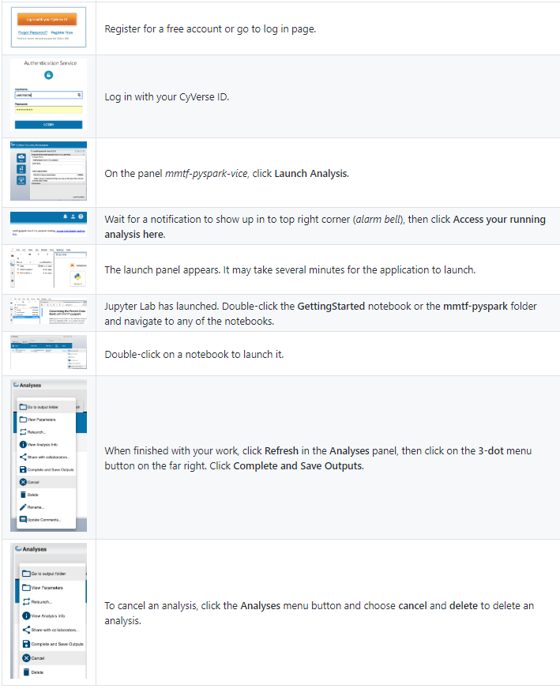

How to Run mmtf-pyspark on CyVerse/VICE
=======================================

After clicking the

.. image:: vice_badge.png
   :target: https://de.cyverse.org/de/?type=apps&app-id=420b82f4-2747-11e9-9ee3-008cfa5ae621&system-id=de 

button, follow the steps below to launch Jupyter Lab, run your analyses, and save your results.

See also: `VICE Starting JupyterLab App <https://cyverse-visual-interactive-computing-environment.readthedocs-hosted.com/en/latest/user_guide/quick-jupyter.html>`_ | `VICE Webinar <https://www.youtube.com/watch?v=KpBC0nScfL0>`_ | `Discovery Environment Guide <https://learning.cyverse.org/projects/discovery-environment-guide/en/latest/>`_

